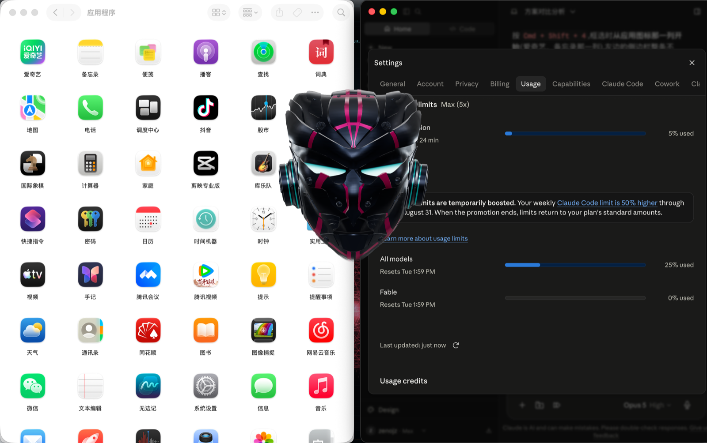

# Ashley



Built and demoed on Douyin by [@陆叁昧](https://www.douyin.com/user/601786286)
(Douyin ID `601786286`), where the build process, the mistakes, and the parts
that took several attempts are documented as they happened.

Ashley is a macOS desktop voice assistant. Its transparent Three.js avatar
floats above the desktop and supports voice interaction, assembly and fracture
effects, rotation, gestures, weather lookup, and experimental music control.

## Wake-word availability and limitations

- **Works out of the box:** only **“Hey Jarvis”**, using the bundled community
  openWakeWord model. The phrase belongs to that upstream model and is
  unrelated to this project's name.
- **Experimental Ashley wake:** after you enroll your voice, **“Ashley”** can
  wake the app through local personal acoustic-template matching. This path
  verifies the enrolled speaker but has no independent word-level model, so it
  can false-wake more often around television, music, or other speakers.
- **Stable custom wake words:** train a word-level ONNX model with
  `scripts/wake-word-training`, place it in `assets/wake-word/models/`, and
  enable it with `JARVIS_EXTRA_WAKE_MODELS`. The repository does not include
  the maintainer's personal models, thresholds, samples, or recordings.

The repository ships with an optimized, openly licensed sci-fi helmet and
programmatically generated sound effects. It does not include API credentials,
personal wake-word models, voice-training samples, or local recordings.

## Community Edition

This is the Community Edition. It is a complete, working assistant, but it is
not everything the author runs locally. The boundary is stated here so that
nobody has to clone the project to discover it.

**Included and fully functional**

- The bundled “Hey Jarvis” wake word, local personal voice enrollment, and a
  configurable runtime path for word-level models you train yourself
- Realtime voice conversation through Doubao or OpenAI, with barge-in
- The transparent 3D avatar: assembly, fracture, rotation, and gestures
- Weather, using device location
- Apple Maps search and directions
- Launching and quitting applications, including localized Chinese app names
- macOS Spaces switching
- Experimental music control for Kugou and NetEase Cloud Music

**Deliberately not included**

- **The Codex bridge.** In the author's private build, the assistant can hand a
  task to a coding agent that writes and runs code, and can drive other
  applications through the macOS accessibility APIs. That path executes
  arbitrary commands on the host and needs a carefully restricted environment
  to be safe. Shipping it enabled-by-default to strangers is not a risk this
  project is willing to take on, so it is not part of the public build.
- **The holographic map.** It depends on a separate private application.

Everything listed as included works without either of them. Nothing in this
repository is stubbed out or crippled: the omissions are whole features that
were removed cleanly, not disabled code paths.

## Requirements

- macOS 13 Ventura or newer (Apple silicon is the primary tested target)
- Node.js 22 or newer
- pnpm 9 or newer
- Xcode Command Line Tools, for the native location helper
- Optional: `ffmpeg`, only when regenerating the bundled sound effects

## API credentials

Copy `.env.example` to `.env`, then fill in only the providers you intend to
use. Never commit `.env`.

- `OPENAI_API_KEY`: OpenAI Realtime voice. Create a key using the
  [OpenAI developer quickstart](https://platform.openai.com/docs/quickstart/make-your-first-api-request).
- `DOUBAO_APP_ID`, `DOUBAO_API_KEY`, `DOUBAO_RESOURCE_ID`: optional Doubao
  voice provider. Create an application and enable the required service in the
  [Doubao Voice documentation](https://www.volcengine.com/docs/6561/196768).
- `QWEATHER_API_HOST`, `QWEATHER_API_KEY`: optional weather lookup. Create a
  project and credential using the
  [QWeather project and credential guide](https://dev.qweather.com/en/docs/configuration/project-and-key/).
- `JARVIS_DEFAULT_CITY`: city used when a weather request does not name one.

## Install and run

```bash
cp .env.example .env
pnpm install
pnpm dev
```

On the first launch, macOS may request microphone, accessibility, Apple Events,
and location permissions. Grant only the permissions needed by the features you
use.

To build without launching Electron:

```bash
pnpm build
```

To create an unpacked macOS application:

```bash
pnpm package:mac
```

`scripts/sign-macos.sh` uses ad-hoc signing by default. Set
`JARVIS_CODESIGN_IDENTITY` to your own certificate name for a distributable
signed build.

## Ashley wake word

The maintainer's Ashley and Jarvis word-level wake-word models
(`ashley.onnx` and `jarvis.onnx`) are not included in this repository. Train
models for your own voice locally with the tooling under
`scripts/wake-word-training`; do not publish the resulting personal models.

To load models you trained yourself without editing TypeScript, put the ONNX
files in `assets/wake-word/models/` and set one line in `.env`:

```dotenv
JARVIS_EXTRA_WAKE_MODELS=ashley:ashley.onnx,jarvis:jarvis.onnx
```

The bundled `hey_jarvis` model remains enabled. Remove or comment out that one
line to return to the default single-model configuration.

Open the tray menu and choose **录入 Ashley 唤醒声纹…** to record the local
wake profile. The profile is stored outside the repository by Electron and is
not uploaded as a project asset. Without an Ashley word-level ONNX model, this
enrolled personal path is experimental speaker/acoustic matching rather than
true lexical recognition.

## Generated sound effects

All bundled effects are synthesized locally from mathematical waveforms. No
downloaded audio samples are used. To regenerate them:

```bash
pnpm generate:sounds
```

This creates `wake.wav`, the approximately 2.6-second `assembly.wav`, and ten
approximately 2-second low-frequency thinking prompts under `assets/sounds/`.

## Rebuilding the helmet asset

The distributed `assets/helmet/model.glb` is already optimized to about 40,000
triangles. If you have a legally obtained source GLB, the repository keeps the
same glTF-Transform pipeline used for the release asset:

```bash
pnpm build:helmet:opensource -- source.glb assets/helmet/model.glb 40000
```

The source model contains no textures, so the pipeline and renderer use
programmatic PBR materials: black brushed gunmetal, layered cyber-pink and
cyber-cyan details, and a smooth cyan emissive eye treatment.

## Experimental music control

Music control is experimental. Some actions depend on application-window
coordinates rather than a stable public API. Updates to Kugou Music or NetEase
Cloud Music can move controls and temporarily break these actions.

## Credits

- Model: [Sci-Fi Helmet - High Poly - Ngchipv](https://sketchfab.com/3d-models/sci-fi-helmet-high-poly-ngchipv-2f7218f88b94455cb69411e4069dc3b9)
- Author: [HiepVu](https://sketchfab.com/ngchipv)
- License: [Creative Commons Attribution 4.0 International (CC BY 4.0)](https://creativecommons.org/licenses/by/4.0/)
- Source: [Sketchfab](https://sketchfab.com/)

Changes for Ashley: geometry reduced from 240,984 to approximately 40,000
triangles; texture-free source materials replaced with programmatic PBR
materials and cyan emissive eye shading.

## License

Project source code is released under the [MIT License](LICENSE). The helmet
model remains available under CC BY 4.0 with the attribution above.
